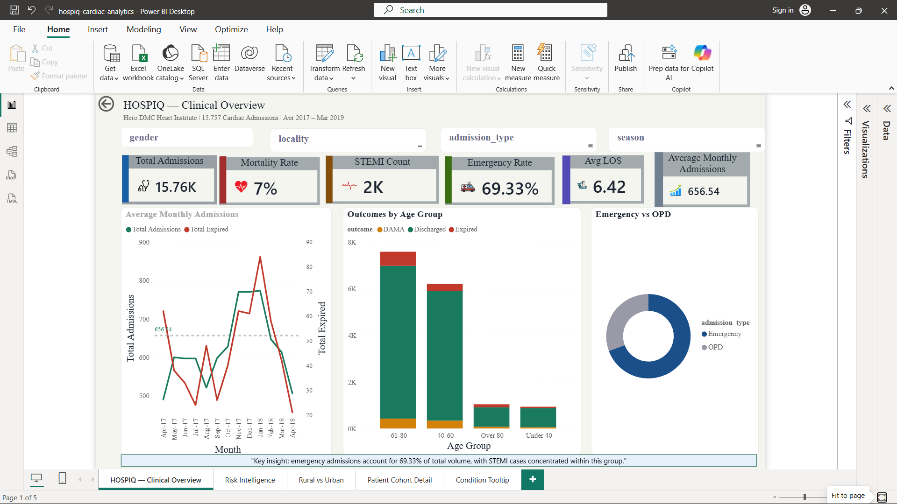
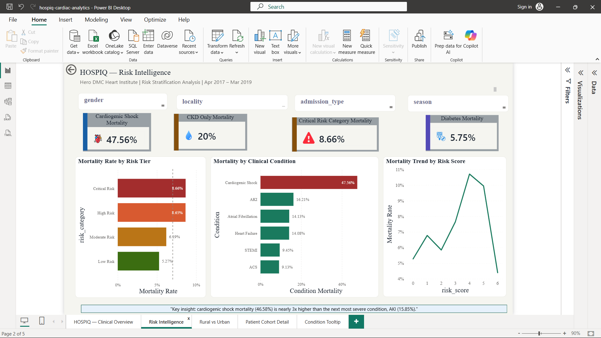
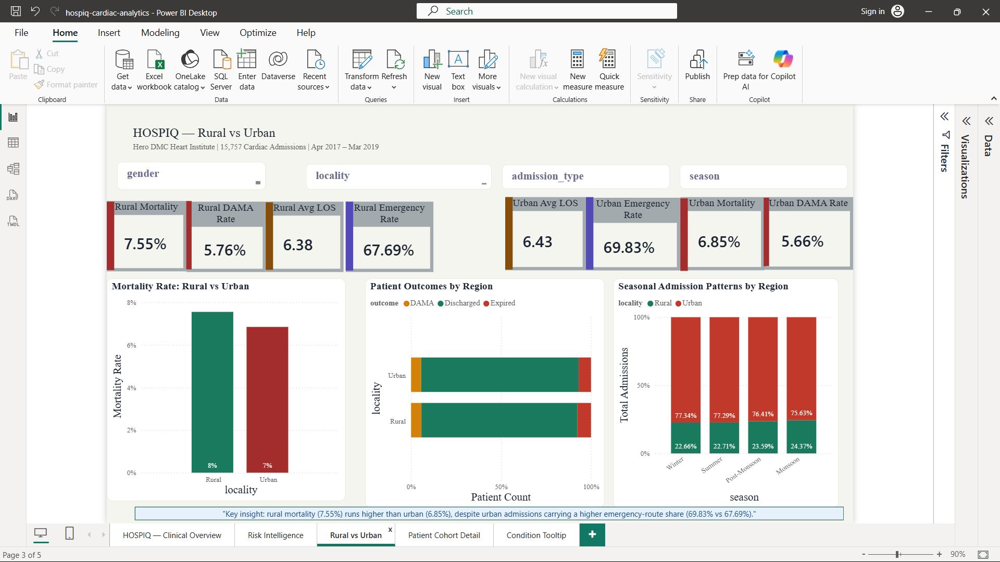
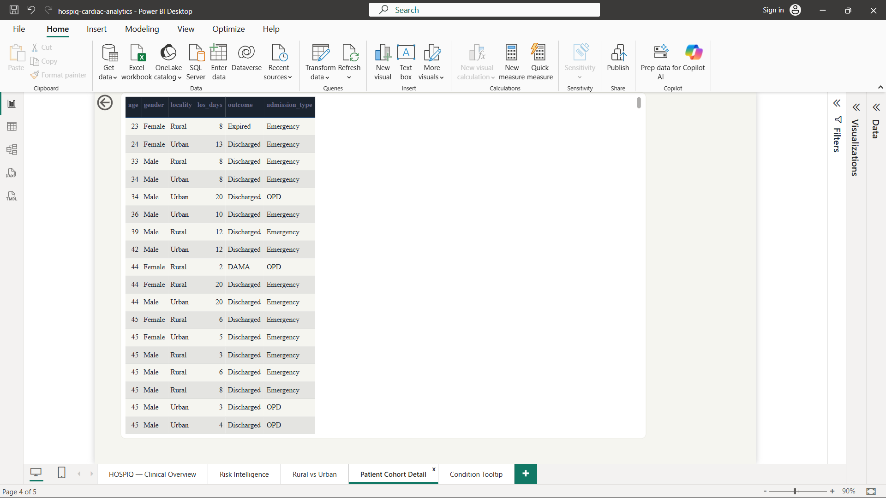

# HOSPIQ — Cardiac Patient Outcomes & Readmission Intelligence Platform


## Project Summary

HOSPIQ is an end-to-end healthcare analytics platform built on **15,757 real cardiac admissions** (12,244 unique patients) from **Hero DMC Heart Institute, Ludhiana**, spanning April 2017 – March 2019. It takes raw, messy hospital admission records and runs them through a full cloud pipeline — Python cleaning, AWS S3 data lake, a PostgreSQL star schema on AWS RDS, SQL analysis, and a Power BI dashboard — to answer the questions a cardiac ward actually cares about: who dies, who leaves against advice, what drives length of stay, and which patients are highest-risk. The goal is to demonstrate what becomes visible when two years of real Indian cardiac data are structured, cleaned, and analysed systematically.

## Real Numbers at a Glance

| Metric | Value |
|--------|-------|
| Total Admissions | 15,757 |
| Unique Patients | 12,244 |
| Mortality Rate | 7.01% (1,105 deaths) |
| DAMA Rate | 5.69% (896 patients) |
| STEMI Cases | 2,202 (14.0%) |
| Heart Failure Cases | 4,561 (28.9%) |
| Emergency Admissions | 69.3% |
| Avg Length of Stay | 6.4 days |
| Data Period | Apr 2017 – Mar 2019 |
| Source | Hero DMC Heart Institute, Ludhiana, Punjab |

## Most Significant Finding

> HTN + CKD patients had a 47.2% mortality rate —
> nearly 7x the hospital average of 7.01%

## Dashboard Screenshots

A 5-page Power BI dashboard built on the cleaned dataset — synced slicers, drill-through, and a custom tooltip page.

### 1 — Clinical Overview


### 2 — Risk Intelligence


### 3 — Rural vs Urban


### 4 — Patient Cohort Detail (drill-through destination)


### 5 — Condition Tooltip (custom tooltip page)


## Key Findings

- Cardiogenic shock mortality (47.56%) is nearly 3x higher than the next most severe condition, AKI (16.21%)
- Rural patients carry a 7.55% mortality rate vs 6.85% urban, despite lower emergency admission rates
- Risk score 4-5 patients show a sharp mortality spike — a non-linear pattern that flat risk models would miss
- 69.33% of all admissions arrive via emergency route, concentrating clinical risk in that pathway

## Project Status

| Layer | Status | Details |
|---|---|---|
| AWS S3 | ✅ Complete | Raw + cleaned data stored, RDS deleted |
| Python | ✅ Complete | 4 pipeline scripts, EDA notebook, SQL runner |
| SQL | ✅ Complete | Star schema, 10 queries, 3 views |
| Power BI | ✅ Complete | 5-page dashboard, drill-through, custom tooltips, DAX measures |
| GitHub | ✅ Complete | Full documentation and screenshots |

## Tech Stack

| Layer | Tool | Purpose |
|-------|------|---------|
| Raw Storage | AWS S3 | Data lake |
| Processing | Python + pandas | Cleaning pipeline |
| Database | PostgreSQL on AWS RDS | Star schema |
| Analysis | SQL | 10 business queries |
| Visualisation | Power BI | 5-page dashboard |
| Exploration | Jupyter Notebook | EDA |

## Project Structure

```
hospiq-cardiac-analytics/
├── README.md                          # Project overview (this file)
├── PLAN.md                            # Full 7-phase project roadmap
├── .gitignore                         # Excludes secrets, raw data, caches
├── requirements.txt                   # Python dependencies
├── .env.example                       # Environment-variable template
│
├── docs/
│   ├── DATA_DICTIONARY.md             # Every column: original → clean name, type, values
│   ├── ARCHITECTURE.md                # Cloud pipeline + schema + security notes
│   ├── EDA_REPORT.md                  # Phase 1 exploration findings
│   ├── DATA_CLEANING_DECISIONS.md     # Phase 2 cleaning rationale
│   ├── BUSINESS_INSIGHTS.md           # Phase 5 SQL findings
│   ├── INTERVIEW_PREP.md              # 20 Q&A for portfolio interviews
│   └── SQL_QUERY_GUIDE.md             # Plain-English explanation of each query
│
├── sql/
│   ├── 01_schema.sql                  # Star-schema DDL (dims + fact)
│   ├── 02_analysis_queries.sql        # 10 business-question queries
│   └── 03_views.sql                   # 3 Power BI views
│
├── python/
│   ├── 01_upload_to_s3.py             # Raw CSV → S3 raw/
│   ├── 02_clean_transform.py          # Clean + feature-engineer → S3 processed/
│   ├── 03_load_to_rds.py             # Processed CSV → RDS star schema
│   └── 04_eda_charts.py               # Generate EDA charts → assets/screenshots/
│
├── notebooks/
│   └── 01_eda_exploration.ipynb       # Phase 1 interactive exploration
│
├── powerbi/                           # Power BI .pbix (gitignored)
├── assets/screenshots/                # Dashboard + chart screenshots
└── data/                              # raw/ + processed/ (gitignored, local only)
```

## Phase Status

| Phase | Description | Status |
|-------|-------------|--------|
| 1 | Data Exploration (EDA) | ✅ Complete |
| 2 | Data Cleaning | ✅ Complete |
| 3 | AWS Infrastructure | ✅ Complete |
| 4 | Database Loading | ✅ Complete |
| 5 | SQL Analysis | ✅ Complete |
| 6 | Power BI Dashboard | ✅ Complete |
| 7 | Final Documentation | ✅ Complete |

## Dataset

Source: Kaggle — Hero DMC Heart Institute
Link: https://www.kaggle.com/datasets/ashishsahani/hospital-admissions-data
Real Indian hospital data — not synthetic.

## Repository Navigation

- Start with **PLAN.md** for the full project roadmap
- See **docs/EDA_REPORT.md** for data exploration findings
- See **docs/DATA_CLEANING_DECISIONS.md** for cleaning rationale
- See **docs/BUSINESS_INSIGHTS.md** for SQL findings
- See **docs/INTERVIEW_PREP.md** for 20 Q&A
