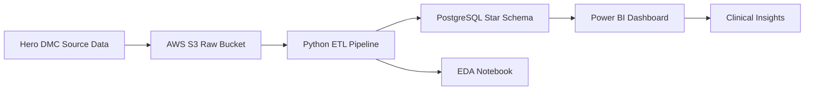
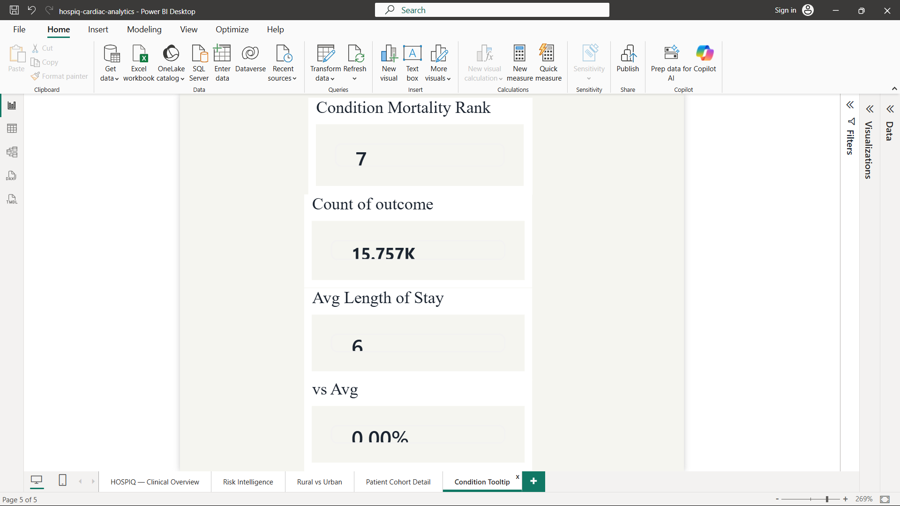

# HOSPIQ — Cardiac Patient Outcomes & Readmission Intelligence Platform

**An end-to-end healthcare analytics engagement turning 15,757 real cardiac admissions into board-level clinical and operational intelligence.**


---

## Executive Summary

HOSPIQ analyses two fiscal years of cardiac admissions (April 2017 – March 2019) from **Hero DMC Heart Institute, Ludhiana** to quantify where clinical risk concentrates and where operational capacity is strained. Across **15,757 admissions (12,244 unique patients)**, in-hospital mortality runs at **7.01%**, but that headline masks the real story: mortality is highly concentrated — cardiogenic-shock patients die at **47.56%**, and **69.33%** of all volume arrives through the emergency pathway. The engagement delivers a governed data pipeline (AWS S3 → Python → PostgreSQL star schema) and a five-page Power BI decision platform that lets clinical and operations leaders move from anecdote to evidence.

## Business Problem

Tertiary cardiac centres generate rich admission data but rarely convert it into decisions. Leadership needs to answer, with evidence: *Which patients are most likely to die, and can we see them coming? Where is capacity strained, and when? Are outcomes equitable across the populations we serve?* HOSPIQ answers these by structuring raw admission records into a queryable warehouse and surfacing risk, capacity, and equity signals in a single governed dashboard.

## Stakeholders

| Stakeholder | What they get from HOSPIQ |
|---|---|
| **Chief Medical Officer (CMO)** | Mortality drivers, risk-tier validation, and equity gaps to steer clinical policy |
| **Clinical Risk Team** | A validated composite risk score and condition-level mortality ranking for triage |
| **Operations / Capacity Director** | Emergency-load share, seasonal admission peaks, and length-of-stay distribution for staffing and bed planning |
| **Quality & Governance** | DAMA tracking and outcome transparency for audit and improvement programmes |

## Project Objectives

- Build a reproducible, cloud-based pipeline from raw source data to an analytics-ready star schema.
- Quantify in-hospital mortality and isolate the clinical conditions and comorbidity combinations that drive it.
- Validate whether a simple, explainable composite **risk score** meaningfully predicts mortality.
- Expose operational pressure points — emergency-route concentration, seasonal surge, length-of-stay tails.
- Surface equity gaps (rural vs urban outcomes) that warrant structural intervention.

## Dataset Overview

| Attribute | Detail |
|---|---|
| Source | Hero DMC Heart Institute, Ludhiana, Punjab, India (Kaggle: *Hospital Admissions Data*) |
| Grain | One row per admission event |
| Volume | 15,757 admissions · 12,244 unique patients (3,513 repeat admissions) |
| Period | April 2017 – March 2019 (two Indian fiscal years) |
| Key dimensions | Demographics (age, gender, locality), admission route, outcome, 30+ clinical/comorbidity flags, lab values, ejection fraction, engineered risk score |

## Data Dictionary (key fields)

| Field | Business definition |
|---|---|
| `outcome` | Admission disposition — Discharged / Expired / DAMA (left against medical advice) |
| `admission_type` | Care pathway — Emergency or OPD (planned/outpatient) |
| `locality` | Patient residence — Rural or Urban (healthcare-access proxy) |
| `los_days` | Length of stay in days — capacity and cost driver |
| `ef` | Ejection fraction (%) — left-ventricular pump efficiency; core survival signal |
| `stemi` | ST-elevation myocardial infarction — time-critical, high-acuity event |
| `cardiogenic_shock` | Cardiac-origin shock — the single deadliest condition in this population |
| `ckd` | Chronic kidney disease — dominant comorbidity multiplier for mortality |
| `risk_score` | Engineered 0–6 composite of six clinical flags (diabetes, hypertension, CAD, CKD, low EF, high creatinine) |
| `risk_category` | Risk band derived from `risk_score` — Low / Moderate / High / Critical |

Full field-level dictionary: [`docs/DATA_DICTIONARY.md`](docs/DATA_DICTIONARY.md).

## Methodology

Raw admission data lands in an S3 raw zone, is cleaned and feature-engineered in Python, loaded into a PostgreSQL star schema on AWS RDS, analysed with SQL, and served to a Power BI decision layer.



The warehouse follows a **star schema**: `dim_patient` (12,244 rows), `dim_date` (730 rows), and `fact_admissions` (15,757 rows), with foreign-key integrity verified (zero orphaned rows).

## Data Cleaning Process

Raw hospital exports are messy in ways that silently corrupt analysis; each fix below was validated against known totals.

- **Mixed date formats** — the admission-date column mixed `M/D/YYYY` (early records) and `D/M/YYYY` (later records). A naïve day-first parse failed on 3,767 rows; disambiguating against the `month year` reference recovered **3,489 rows with zero failures**, preventing near-total corruption of length-of-stay calculations.
- **Disguised missing values** — lab columns contained the literal string `"EMPTY"` (**840 occurrences** across 8 columns) that standard null checks miss. These were coerced to true nulls before imputation.
- **Clinically-aware imputation** — BNP (53.57% missing), ejection fraction (9.55%) and other labs were median-filled (never zero-filled, which would be clinically false); BNP is flagged as unsuitable for correlation given its missingness.
- **Standardisation & feature engineering** — coded values mapped to readable labels (R/U → Rural/Urban, E/O → Emergency/OPD), and `age_group`, `season`, `risk_score`, and `risk_category` were engineered.

Rationale for every decision: [`docs/DATA_CLEANING_DECISIONS.md`](docs/DATA_CLEANING_DECISIONS.md).

## Exploratory Data Analysis

- Outcome mix is imbalanced: **87.30% discharged, 7.01% expired, 5.69% DAMA** — 12.7% of admissions end unfavourably.
- The **61–80 age group dominates admission volume** (7,581 admissions) — the highest-burden demographic for the institution.
- Admissions are **emergency-heavy (69.33%)** and seasonally peaked.
- Length of stay is right-skewed (median 5 days, mean 6.42) with a long tail to 98 days.

Full exploration: [`analysis/eda_notebook.ipynb`](analysis/eda_notebook.ipynb) and [`docs/EDA_REPORT.md`](docs/EDA_REPORT.md).

## Key Business Insights

- **Cardiogenic shock is the dominant killer** — 47.56% mortality, nearly **3× the next most severe condition (AKI, 16.21%)**.
- **A rural–urban equity gap exists** — rural patients die at **7.55%** vs **6.85%** urban, *despite* arriving via emergency less often (67.69% vs 69.83%), pointing to structural access disparity rather than acuity.
- **Risk is non-linear** — patients at **risk score 4–5 show a sharp mortality spike** that flat, additive risk models would systematically underestimate.
- **Emergency concentration** — **69.33%** of admissions arrive via the emergency route, concentrating clinical risk and staffing pressure in that pathway.
- **Demographic burden** — the **61–80 cohort** drives the largest share of volume, defining where capacity and monitoring investment should focus.

## KPI Definitions

| KPI | Formula (business logic) | Interpretation | Clinical relevance |
|---|---|---|---|
| Mortality Rate | Expired admissions ÷ total admissions | Share of admissions ending in death (7.01%) | Core quality-of-care outcome |
| STEMI Count | Count of STEMI-flagged admissions | Volume of time-critical heart attacks (2,202) | Sizes the acute-intervention workload |
| Emergency Rate | Emergency admissions ÷ total admissions | Share arriving unplanned (69.33%) | Drives ED staffing & capacity |
| Avg Length of Stay | Mean of `los_days` | Typical bed-days consumed (6.42) | Capacity & cost planning |
| Cohort Avg Mortality | `CALCULATE([Mortality Rate], ALL(...))` | Filter-independent 7.01% baseline | Benchmark any segment against the whole |
| Condition Mortality Rank | `RANKX` over conditions by mortality | Orders conditions by lethality | Focuses intervention on the deadliest |

## Dashboard Overview

- **1 · Clinical Overview** — the executive scorecard: five headline KPI cards (Total Admissions 15,757, Mortality 7.01%, STEMI 2,202, Emergency Rate 69.33%, Avg LOS 6.42), a monthly admissions trend with an average reference line, outcomes by age group, and an Emergency-vs-OPD donut.
- **2 · Risk Intelligence** — condition- and tier-level mortality: cardiogenic shock (47.56%), CKD-only (20%), Critical-risk (8.66%) and diabetes (5.75%) cards, a severity-gradient mortality-by-risk-tier bar, mortality by clinical condition with cardiogenic shock flagged as the outlier, and a mortality-by-risk-score trend that exposes the non-linear spike.
- **3 · Rural vs Urban** — an equity view: eight paired cards comparing mortality, DAMA, LOS and emergency rate across localities, plus three comparative charts making the 7.55% vs 6.85% gap explicit.
- **4 · Patient Cohort Detail** — a drill-through destination (right-click any risk-tier bar) that lists patient-level records for the selected cohort, letting clinicians move from aggregate to individual.
- **5 · Condition Tooltip** — a custom report-page tooltip that surfaces a condition's mortality rank, volume, average LOS, and delta vs the cohort average on hover.

## Recommendations

1. **Stand up a cardiogenic-shock rapid-response protocol.** At 47.56% mortality it is the highest-yield target; even modest improvement moves the hospital-wide rate.
2. **Operationalise the risk score at admission**, with escalation triggers at score 4–5 where the non-linear mortality spike occurs.
3. **Prioritise the cardio-renal patient.** CKD is the dominant comorbidity multiplier — flag CKD + hypertension arrivals for intensified monitoring.
4. **Align staffing to the emergency-heavy, seasonally-peaked demand** (69.33% emergency) so surge periods are covered proactively.
5. **Launch a rural-outcomes review** to investigate the access-driven mortality gap (7.55% vs 6.85%) — e.g. referral fast-tracking and tele-triage.

## Business Impact

- Cardiogenic-shock patients (944 admissions) die at 47.56%. A protocol that cut that mortality by even **5 percentage points** would prevent roughly **47 deaths** across a comparable two-year window.
- Because mortality is *concentrated* (shock, low EF, CKD, risk 4–5) rather than uniform, targeted intervention on a small high-risk cohort can move the 7.01% headline far more efficiently than broad, undirected effort.
- A validated risk score enables triage prioritisation without new equipment — a low-cost, high-leverage operational win.

*(Impact figures are illustrative projections applied to the actual observed cohort sizes; no outcomes are claimed beyond what the data shows.)*

## Tech Stack

| Tool | Version | Purpose |
|---|---|---|
| Python | 3.12 | ETL, cleaning, feature engineering, EDA |
| pandas / numpy | 2.2 / 1.26 | Data wrangling |
| boto3 | 1.34 | AWS S3 integration |
| psycopg2 / SQLAlchemy | 2.9 / 2.0 | PostgreSQL loading |
| AWS S3 | — | Raw + processed data lake |
| AWS RDS (PostgreSQL) | 15 | Star-schema warehouse (deleted post-project → $0 billing) |
| Power BI Desktop | — | 5-page dashboard, DAX, drill-through, custom tooltips |
| Jupyter | — | Exploratory analysis |

## Repository Structure

```
hospiq-cardiac-analytics/
├── data/
│   ├── raw/                      # Original Kaggle CSVs (gitignored — re-downloadable)
│   └── processed/                # hdhi_admission_cleaned.csv (dashboard source)
├── pipeline/
│   ├── 01_extract_load.py        # Upload raw CSVs to AWS S3
│   ├── 02_clean_transform.py     # Clean + feature-engineer → processed CSV
│   ├── 03_load_postgres.py       # Load star schema into PostgreSQL
│   ├── 04_sql_runner.py          # Run the 10 analytical queries
│   └── test_rds_connection.py    # RDS connectivity check
├── analysis/
│   ├── eda_notebook.ipynb        # Exploratory data analysis
│   ├── eda_charts.py             # Standalone EDA chart generator
│   └── sql/
│       ├── schema.sql            # Star-schema DDL
│       ├── queries.sql           # 10 analytical queries
│       └── views.sql             # 3 Power BI views
├── dashboard/                    # Power BI notes (.pbix shared on request)
├── screenshots/                  # Dashboard + EDA + pipeline proof images
├── docs/                         # Data dictionary, architecture, insights, cleaning log, interview prep
├── PLAN.md
├── requirements.txt
├── .gitignore
└── LICENSE
```

## Installation & Run

```bash
# 1. Clone and enter
git clone https://github.com/Vitthal38/hospiq-cardiac-analytics.git
cd hospiq-cardiac-analytics

# 2. Environment
python -m venv venv
# Windows: .\venv\Scripts\Activate.ps1   |   macOS/Linux: source venv/bin/activate
pip install -r requirements.txt

# 3. Configure credentials
cp .env.example .env        # fill in AWS + RDS values

# 4. Run the pipeline (from repo root)
python pipeline/01_extract_load.py      # raw CSVs -> S3
python pipeline/02_clean_transform.py   # clean -> data/processed/ + S3
python pipeline/03_load_postgres.py     # load star schema into RDS
python pipeline/04_sql_runner.py        # run the 10 analytical queries

# 5. Open the Power BI report on the cleaned CSV (or the RDS views)
```

## Dashboard Screenshots

### 1 — Clinical Overview


### 2 — Risk Intelligence


### 3 — Rural vs Urban


### 4 — Patient Cohort Detail (drill-through)


### 5 — Condition Tooltip (custom tooltip page)


## Future Enhancements

- **Readmission analysis** using the 3,513 repeat admissions as a labelled signal.
- **Predictive mortality model** (logistic regression / gradient boosting) to replace the additive risk score with a calibrated probability.
- **Pollution correlation** — the dataset includes an air-quality file; correlate AQI with STEMI volume by month.
- **Survival analysis** using admission/discharge dates for time-to-event rather than a binary outcome.
- **Near-real-time refresh** — automate the S3 → RDS → Power BI path for a live feed.

## License

Released under the [MIT License](LICENSE).

## Author

**Vitthal Misal** — Data Analyst
- GitHub: [@Vitthal38](https://github.com/Vitthal38)
- LinkedIn: [linkedin.com/in/vitthal-misal](https://linkedin.com/in/vitthal-misal)
- Email: misalvitthal38@gmail.com
