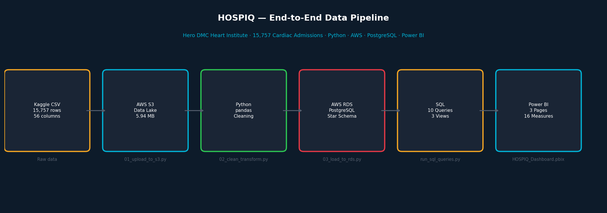

# HOSPIQ — System Architecture

## Pipeline Overview

```
┌─────────────────────────────────────────────────────────────┐
│                    DATA PIPELINE                             │
├─────────────────────────────────────────────────────────────┤
│                                                             │
│  [Kaggle CSV]                                               │
│       ↓                                                     │
│  [python/01_upload_to_s3.py]                               │
│       ↓                                                     │
│  [AWS S3 — hospiq-cardiac-data-935140613339]               │
│       raw/  ← 4 original files                             │
│       processed/  ← cleaned CSV (3.34 MB)                  │
│       ↓                                                     │
│  [python/02_clean_transform.py]                            │
│       ↓ 15 cleaning steps                                  │
│       ↓ 5 validation checks                                │
│       ↓                                                     │
│  [AWS S3 — processed/hdhi_admission_cleaned.csv]           │
│       ↓                                                     │
│  [python/03_load_to_rds.py]                                │
│       ↓ Star schema load                                    │
│       ↓                                                     │
│  [AWS RDS PostgreSQL 15 — hospiq-db]                       │
│       dim_patient    (12,244 rows)                         │
│       dim_date       (730 rows)                            │
│       fact_admissions (15,757 rows)                        │
│       ↓                                                     │
│  [sql/02_analysis_queries.sql — 10 business queries]       │
│  [sql/03_views.sql — 3 analytical views]                   │
│       ↓                                                     │
│  [Power BI Desktop — direct RDS connection]                │
│       Page 1: Clinical Overview                            │
│       Page 2: Risk Intelligence                            │
│       Page 3: Rural vs Urban Disparity                     │
│                                                             │
└─────────────────────────────────────────────────────────────┘
```

## AWS Resources

| Resource | Name | Type | Region | Cost |
|----------|------|------|--------|------|
| S3 Bucket | hospiq-cardiac-data-935140613339 | Standard | ap-south-1 | ~$0.00/mo |
| RDS Instance | hospiq-db | db.t3.micro PostgreSQL 15 | ap-south-1 | Free tier |

## S3 Bucket Structure

```
hospiq-cardiac-data-935140613339/
├── raw/
│   ├── HDHI Admission data.csv     (2.48 MB — original dataset)
│   ├── HDHI Mortality Data.csv     (10.1 KB)
│   ├── HDHI Pollution Data.csv     (64.5 KB)
│   └── table_headings.csv          (49.6 KB)
└── processed/
    └── hdhi_admission_cleaned.csv  (3.34 MB — Phase 2 output)
```

Raw files are never modified.
All transformations produce new files in processed/.

## Database Schema

### Star Schema Design

```
dim_patient (12,244 rows — one per unique patient)
┌─────────────────┬─────────────┬─────────────────────────────┐
│ Column          │ Type        │ Description                  │
├─────────────────┼─────────────┼─────────────────────────────┤
│ mrd_no (PK)     │ VARCHAR(20) │ Medical record number        │
│ age             │ INTEGER     │ Patient age                  │
│ age_group       │ VARCHAR(20) │ Engineered: Under40/40-60... │
│ gender          │ VARCHAR(10) │ Male / Female                │
│ locality        │ VARCHAR(10) │ Rural / Urban                │
└─────────────────┴─────────────┴─────────────────────────────┘

dim_date (730 rows — one per unique date)
┌─────────────────┬─────────────┬─────────────────────────────┐
│ Column          │ Type        │ Description                  │
├─────────────────┼─────────────┼─────────────────────────────┤
│ date_id (PK)    │ DATE        │ Calendar date                │
│ day_name        │ VARCHAR(10) │ Monday, Tuesday...           │
│ month_name      │ VARCHAR(10) │ April, May...                │
│ month_num       │ INTEGER     │ 1-12                         │
│ year            │ INTEGER     │ 2017, 2018, 2019             │
│ quarter         │ VARCHAR(5)  │ Q1, Q2, Q3, Q4              │
│ fiscal_quarter  │ VARCHAR(5)  │ Indian FY: Apr=Q1            │
│ season          │ VARCHAR(20) │ Summer/Monsoon/Post/Winter   │
│ is_weekend      │ BOOLEAN     │ True if Sat/Sun              │
└─────────────────┴─────────────┴─────────────────────────────┘

fact_admissions (15,757 rows — one per admission)
┌──────────────────────────┬─────────────┬───────────────────────────┐
│ Column                   │ Type        │ Description               │
├──────────────────────────┼─────────────┼───────────────────────────┤
│ sno (PK)                 │ INTEGER     │ Serial number             │
│ mrd_no (FK→dim_patient)  │ VARCHAR(20) │ Patient reference         │
│ admission_date(FK→dim_date)│ DATE      │ Date reference            │
│ discharge_date           │ DATE        │ Date of discharge         │
│ admission_type           │ VARCHAR(20) │ Emergency / OPD           │
│ los_days                 │ INTEGER     │ Length of stay in days    │
│ icu_days                 │ INTEGER     │ Days in ICU               │
│ outcome                  │ VARCHAR(20) │ Discharged/Expired/DAMA   │
│ [comorbidity flags]      │ BOOLEAN     │ diabetes, htn, cad, ckd.. │
│ [lab values]             │ NUMERIC     │ hb, tlc, ef, bnp...       │
│ [diagnosis flags]        │ BOOLEAN     │ stemi, heart_failure...   │
│ risk_score               │ INTEGER     │ Engineered: 0-6           │
│ risk_category            │ VARCHAR(20) │ Low/Moderate/High/Critical│
└──────────────────────────┴─────────────┴───────────────────────────┘
```

## Why This Architecture

### Why AWS S3 as data lake?
- Industry standard for raw data storage
- Decouples storage from compute
- Data persists even if scripts fail
- Cost: effectively $0 for this dataset size
- Shows cloud literacy to recruiters

### Why AWS RDS PostgreSQL?
- Production-grade managed database
- Power BI connects directly via PostgreSQL connector
- Enforces FK integrity at database level
- Free tier covers this entire project
- Shows ability to work with cloud databases
  not just local files

### Why Star Schema?
- Standard data warehouse pattern
- Separates facts from dimensions
- Enables efficient aggregation queries
- Power BI relationship model maps directly
- Interviewers recognise and respect it

### Why SQL Views for Power BI?
- Power BI connects to views not raw tables
- Views encapsulate join logic
- If schema changes, update view not Power BI
- Professional data engineering pattern

## Security

- AWS credentials stored in .env (gitignored)
- RDS accessible on port 5432 from authorised IPs only
- No patient data pushed to GitHub
- Raw CSVs excluded from version control
- .env.example provided for setup reference

## Cost Management

RDS free tier: 750 hours/month for 12 months
Strategy: Stop RDS instance when not working
          Delete when project complete
          S3 data persists after RDS deletion

To stop RDS (saves cost):
```
aws rds stop-db-instance \
  --db-instance-identifier hospiq-db \
  --region ap-south-1
```

To start RDS (before working):
```
aws rds start-db-instance \
  --db-instance-identifier hospiq-db \
  --region ap-south-1
```

## Pipeline Screenshots



## Proof of Work

See [screenshots/README.md](../screenshots/README.md)
for visual proof of every completed phase.
