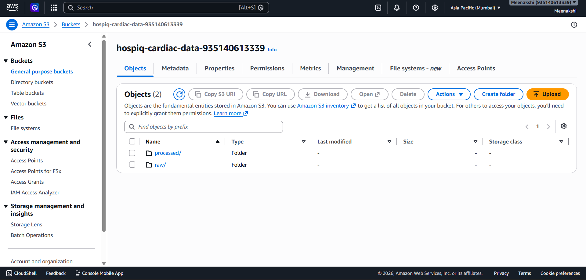
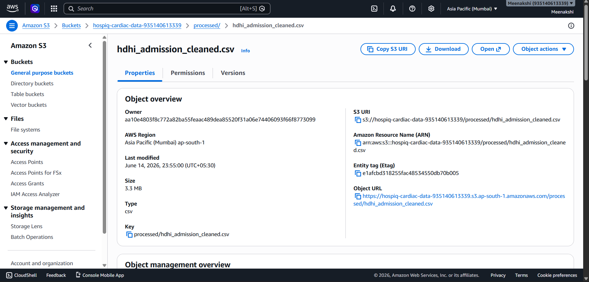
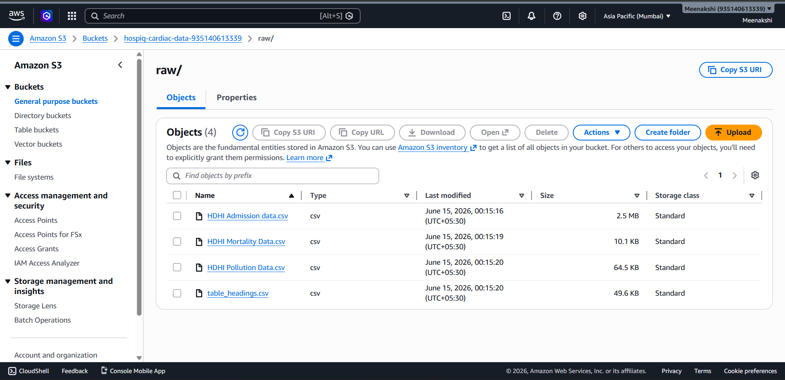

# AWS Infrastructure Evidence

Console screenshots proving AWS was used in this project. The RDS instance was
deleted post-project to avoid billing; the cleaned CSV in `data/processed/`
remains as the live dashboard source.

## S3 Bucket Overview
Bucket root showing the `raw/` and `processed/` prefixes.

## S3 — Processed Zone
`processed/hdhi_admission_cleaned.csv` (~3.3 MB) — the cleaned dataset.

## S3 — Raw Zone
`raw/` folder holding the 4 original source CSVs.

## How AWS was used
- Raw CSVs uploaded to S3 `raw/` via `pipeline/01_extract_load.py` (boto3)
- Cleaned CSV uploaded to S3 `processed/` via `pipeline/02_clean_transform.py`
- Star schema loaded to RDS PostgreSQL via `pipeline/03_load_postgres.py` (psycopg2)
- Power BI connected to RDS via the PostgreSQL connector
- RDS deleted after analysis to eliminate ongoing billing; S3 retained as the persistent source
